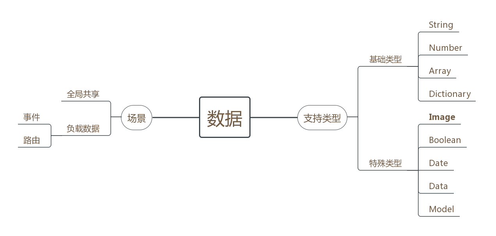

# 数据

我们将数据抽离出来，作为组件交互的重要一环 ，组件间的数据交互分为两种：

1. 数据共享 ： 共享的是所有组件都可以获取的数据。
2. 数据传递 ： 数据也可以附着在路由和事件中传递。

单独的数据组件，是为了解决特殊类型数据的问题。 我们支持特殊数据类型，如**图片**、二进制数据、`Model`类型等。

以下是iOS中的`Axe`框架的使用说明 ：

## AXEData类型

数据是以键值对的形式存储。 

共享的全局数据 ：

	[[AXEData sharedData] numberForKey:TEST_DATA_NUMBER];
	
用于在路由或事件中传递的数据 ：

	  	AXEData *data = [AXEData dataForTransmission];
        [data setData:@"12345678" forKey:LOGIN_DATA_ACCOUNT];
        [self jumpTo:LOGIN_ROUTER_LOGIN]

set方法不需要设置类型，而获取数据时指定类型，避免类型错误。

## Model类型

我们指的`Model`类型，为与后台交互的可序列化的数据。如 ：

	@interface LoginUserInfoModel : JSONModel
	
	@property (nonatomic,strong) NSString *account;
	@property (nonatomic,strong) NSNumber *level;
	@property (nonatomic,strong) NSDictionary *detailInfo;
	@property (nonatomic,strong) NSArray *tagList;
	
	@end
	
我们支持`model`类型跨模块共享，通过声明其类型的结构，以使其他模块可以直接操作`model`类型。 我们对`Model`类型的声明是接口形式的 ：

	@protocol LoginUserInfoModelProtocol <NSObject>
	@property (nonatomic,strong) NSString *account;
	@property (nonatomic,strong) NSNumber *level;
	@property (nonatomic,strong) NSDictionary *detailInfo;
	@property (nonatomic,strong) NSArray *tagList;
	@end
	
而使用则可以比较方便的操作`Model`类型：

	id<LoginUserInfoModelProtocol> userInfo = [payload modelForKey:LOGIN_DATA_USERINFO];
	NSLog(@"登录成功 ,信息如下 ：\n 帐号 : %@ \n 等级: %@ \n detailInfo: %@ \n tagList: %@", userInfo.account, userInfo.level, userInfo.detailInfo, userInfo.tagList])
	
## 数据归属的讨论

如果一个数据，是只有A模块才会创建，那么这个数据属于A模块，其他模块依赖A以读取或修改该数据。

如果一个数据，可以由多个模块创建，则应该将数据放在公共区域，即放在公共业务中。

